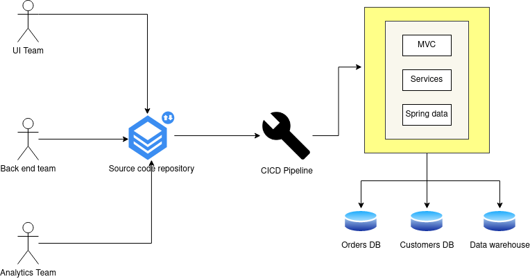

# What is a microservice.

A microservice is a small, loosely coupled, distributed service.
 
Microservice allows you to take a large application and decompose it into <i>easy-to-manage</i> components with narrowly 
defined responsibilities. Microservices help combat the traditional problem of complexity in large code base by 
decomposing the large codebase down into small well-defined pieces.The key concept one needs to embrace as they think 
about microservices is decomposing and unbundling the functionality of applications so that they are completely 
independent of one another. 

Consider the below legacy application used for an orders service.

If we take the Orders service from the above and decompose it into microservices it might look like below.  

&emsp;&emsp;&emsp;&emsp;&emsp;&emsp;(Decomposed microservices)
 
Looking at the decomposed microservices from figure we can observe that each functional teams owns their own service
code and infrastructure. They can build, deploy and test their services independently.
